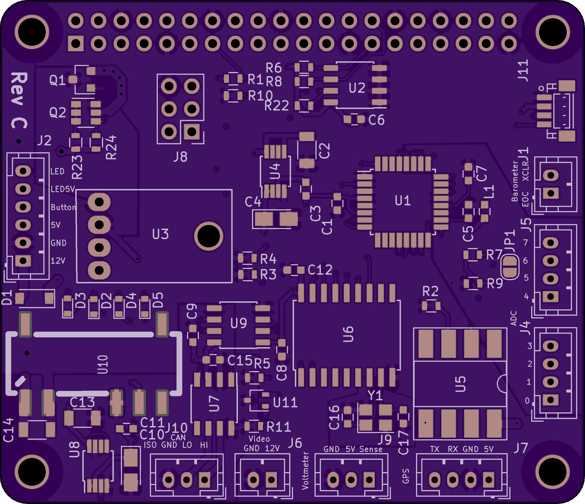

# Chart Plotter Hat

KiCad design for Raspberry Pi Hat. Provides power and switch on/off
for the board. A total of 1.2A is provided for use by the
RaspberryPi. Also some connectors for GPS, barometric sensor, and ADC
measurements. Provides 12V power for a remote video board which is
switched at the same time as the Raspberry Pi. Contains a MCP2515 CAN
Controller and MCP2551 CAN transceiver for access to CAN bus. The
transceiver is isolated from the rest of the board. Has a
 connector that allows I2C
devices to be connected to the Raspberry Pi.

## Functions

1. Onboard ATmega328P
2. 1.2A DC power for RaspberryPi provided by
   
3. Video board power (12V) controlled by solid state relay G3VM-201FR
4. Serial Connector for GPS with 5V power, routed to Raspberry Pi Uart1.
5. 2 connectors with 4 pins each routed to adc pins on ATmega328P
6. Qwiic Connector, routed to I2C1 on Raspberry Pi
7. eeprom & power isolation as required by Raspberry Pi hat spec
8. Onboard 3.3V power for the ATmega328P.
9. SPI on ATmega328P routed to the Raspberry Pi SPI0 for communication
10. MCP2515 CAN network device, controlled by Raspberry Pi on SPI1
11. CAN is isolated to meet specs of NMEA 2000.
12. Connector for external voltmeter, or see 13.
13. Optional 12V voltage divider routed to ADC7 on the ATmega328P. This option is
    selected by a solder jumper.

## Firmware

There are 2 projects for the firmware. One is using `C`, the other `Rust`.
 -  for the
onboard ATmega328P using avr-gcc and avr-libc.
 - .

The Rust firmware is still experimental. There are a number of
compiler bugs for the 8-bit AVR's yet.

